# Hobby - Testing

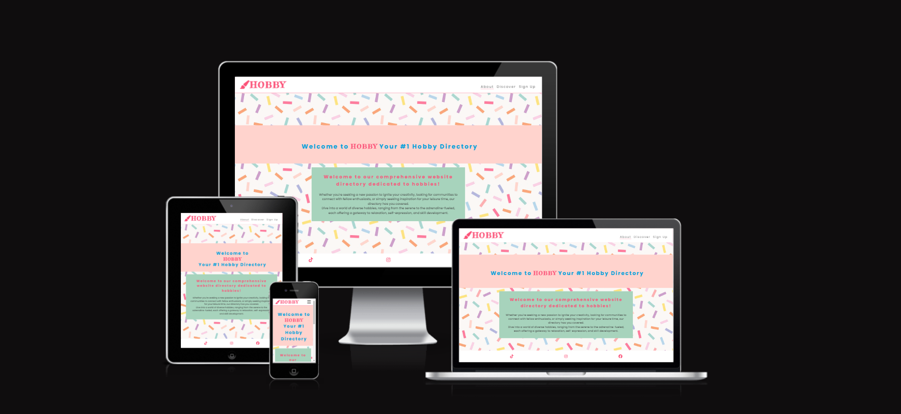

This file was created on the second edition of this project. All issues in the assessment feedback form were carried out first, followed by any additional information that would be of benefit to the README & TESTING sections.

Visit the deployed site [Hobby](https://katemcguane.github.io/hobby/index.html) for reference.

---

## W3C Validator

[W3C](https://katemcguane.github.io/hobby/discover.html) was used to validate the HTML on all pages of the website. 

### HTML

#### About Page (Home Page)

- No errors or warnings were found when passing through the official W3C validator.

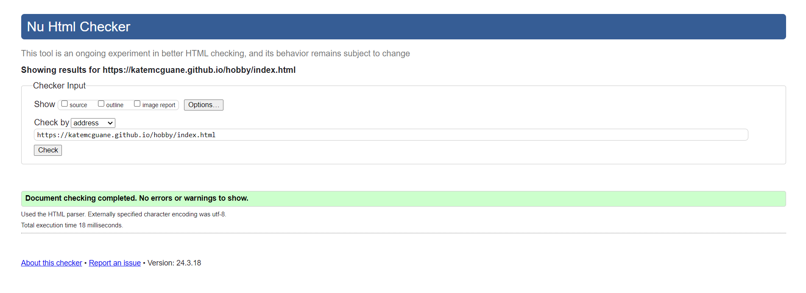 

#### Discover Page

- No errors or warnings were found when passing through the official W3C validator.

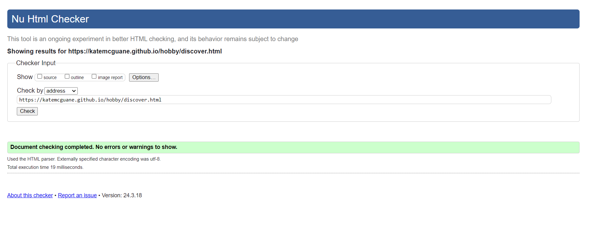 

#### Sign Up Page

- No errors or warnings were found when passing through the official W3C validator. 
- Did encounter some errors before final resolution. See solved bugs below. 

 

#### Response Page

- No errors or warnings were found when passing through the official W3C validator. 
- Did encounter a warning before final resolution. See solved bugs below. 

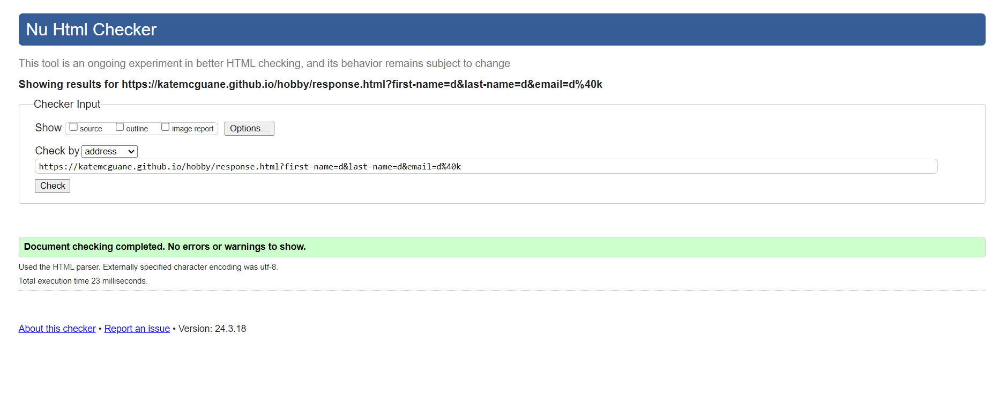

### CSS

- No errors or warnings were found when passing through the official W3C (Jigsaw) validator

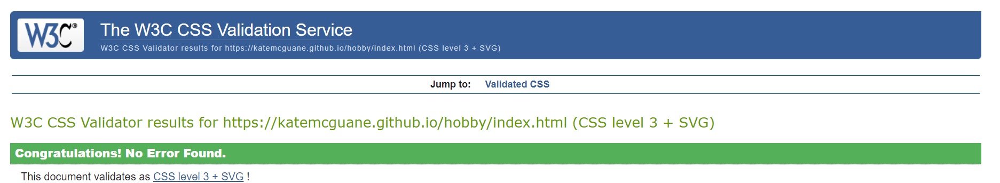

---

## LightHouse report

I used Lighthouse in DevTools to confirm that the website is performing well, accessiblility and readability of fonts & colours. Testing was done for both mobile & desktop.
    
  ### About Page (Home Page)

  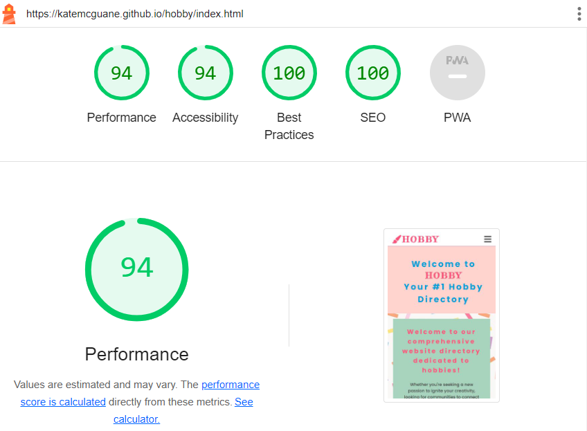
  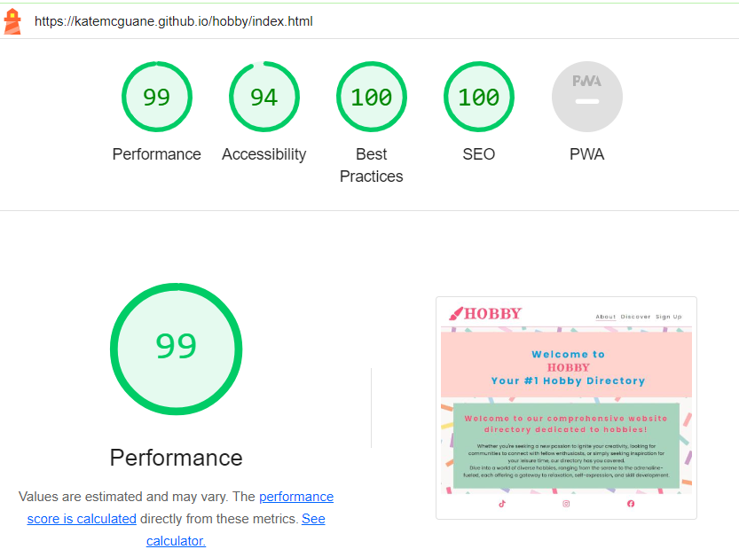

  ### Discover Page

  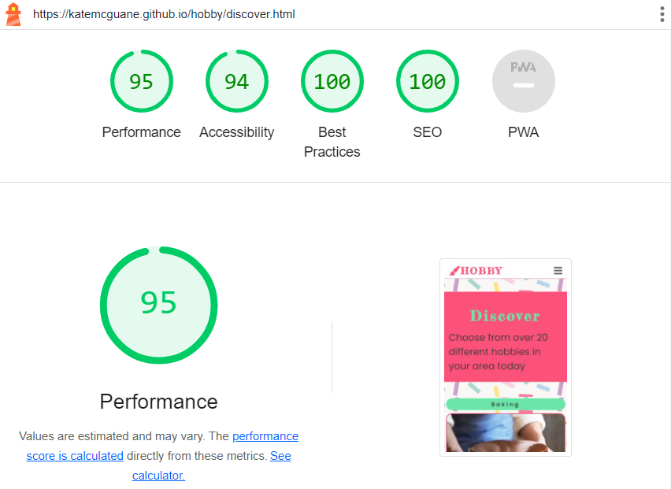
  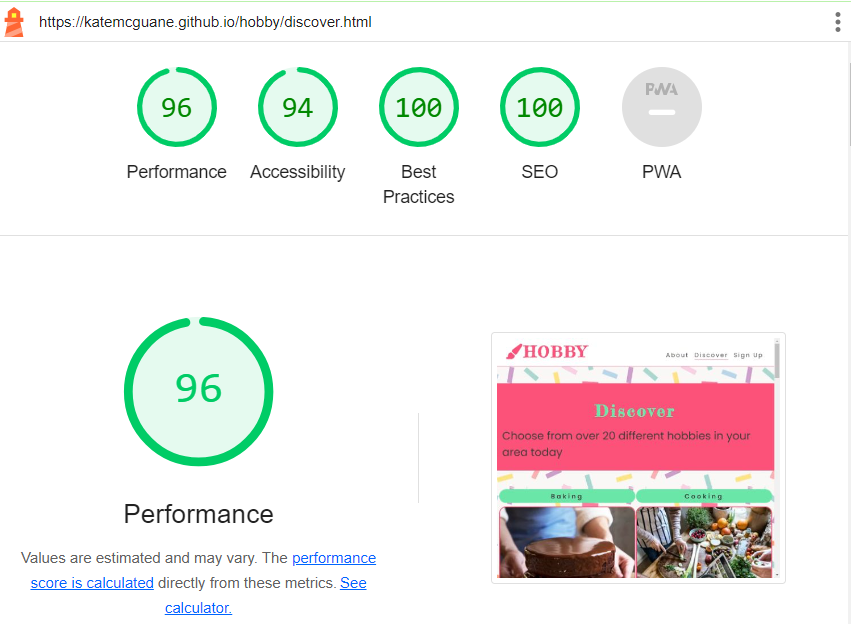

  ### Sign Up Page

  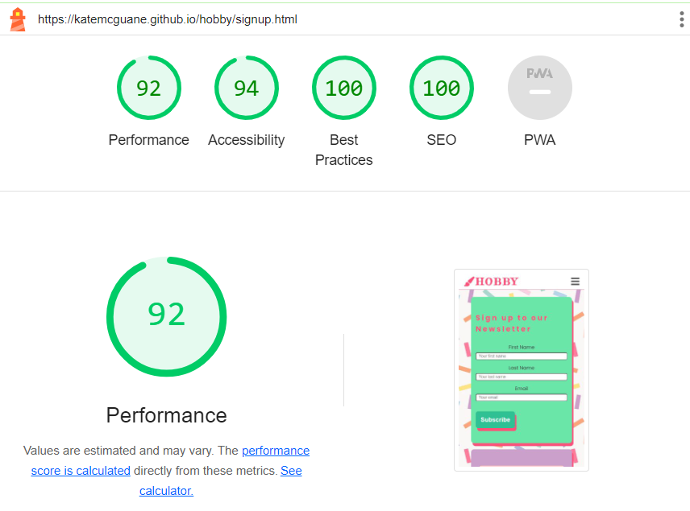
  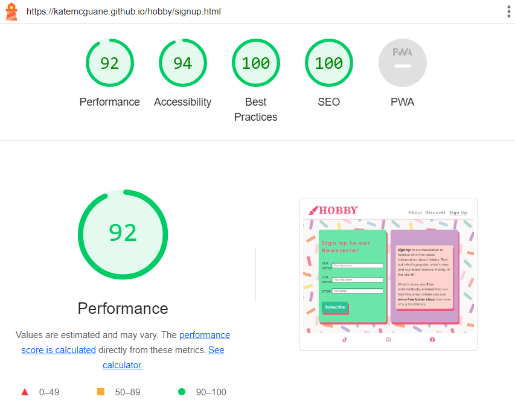

  ### Response page

  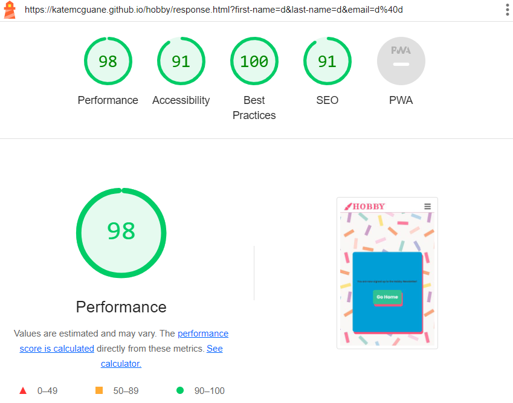
  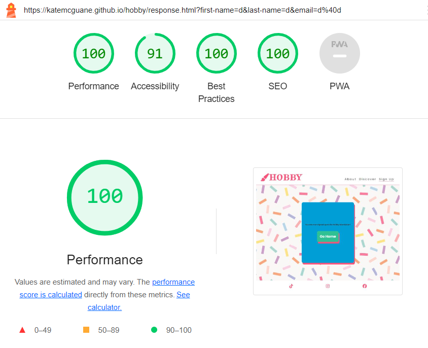

---

The website was tested manually throughout the project development using DevTools to check for responsiveness.

---
## Bugs

### Solved Bugs

| # | Bug | How I solved the issue | Screenshots |
| --- | --- | --- | --- |
| 1 | The README file had additional content that pointed to the UX of another repository for a different project. | I removed the link from aforementioned UX & and additional typos that existed in the README file. I then ensured the rest of the file contained only my own original material & acknowledged credits for same. | --- |
| 2 | The closing brackets were missing from one of the link elements in the heading area. | I added closing brackets to link elements. I ensured this was carried out across all html files as the skeleton of each file was copied from the original index.html. | --- |
| 3 | index.html had an extra </i>. | I removed this tag & ensured this was carried out across all html files as the skeleton of each file was copied from the original index.html. | --- |
| 4 | A stray end tag div in index.html. | Removed stray div. | --- |
| 5 | Duplicate of defined class attribute in section of signup.html. | I removed this unnecessary class attribute. | --- |
| 6 | Duplicate ID input-field in signup.html | I removed the duplicate of the defined class attribute in the section of signup.html. I changed the name of each ID to reflect the use of the input field. I then added these names to the style.css, so as to avoid creating any additional bugs. | --- |
| 7 | More descriptive title tag needed | I elaborated on title tag of each html page, & described each once accordingly. | --- |
| 8 | After adding in a description on the first page, the assigned IDs also affected the layout of the Sign Up page. I attemped to fix this using specificity. | The bug was easily resolved by changing the allocated ID to suit the Sigun Up page specifically. | --- |
| 9 | After altering the ID, it affected the responsiveness of the smaller screens. The containers would no longer stack neatly and were spilling out over the edge of the screen. | I added a <stong><em>flex-wrap: wrap;<em></strong> to the newly defined ID in the #hero-hobbies-subscribe section. | --- |
| 10 | Multiple errors regarding the label & input sections of the Sign Up Page. I had put the for attribute in the input element instead of the label element. | Corrected by adjusting name & location of for attribute. | [Sign Up Error 1](testing/w3/w3_signup_bug1.PNG) [Sign Up Error 2](testing/w3/w3_signup_bug2.PNG) [Sign Up Error 4](testing/w3/w3_signup_bug3.PNG) [Sign Up Errors 4-6](testing/w3/w3_signup_bug4-6.PNG) |
| 11 | Warning for section lacking heading. | Replaced 
 element with a <h6> element. | [Response Warning](testing/w3/w3_response_warning.PNG) |

- Once all of the solutions were carried out, I reviewed each issue to ensure all corrections were applied & no further issues were occurring.

### Known Bugs

| # | Bug | |
| :--- | :--- | :---|
